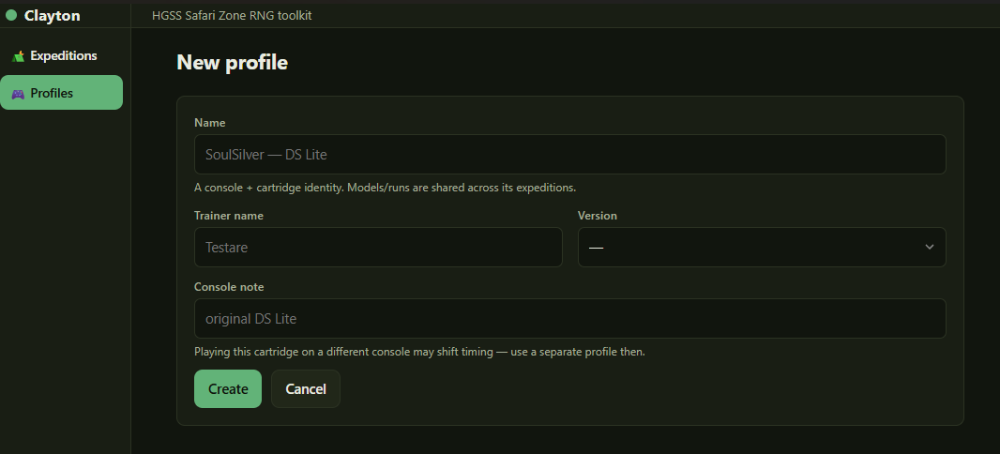
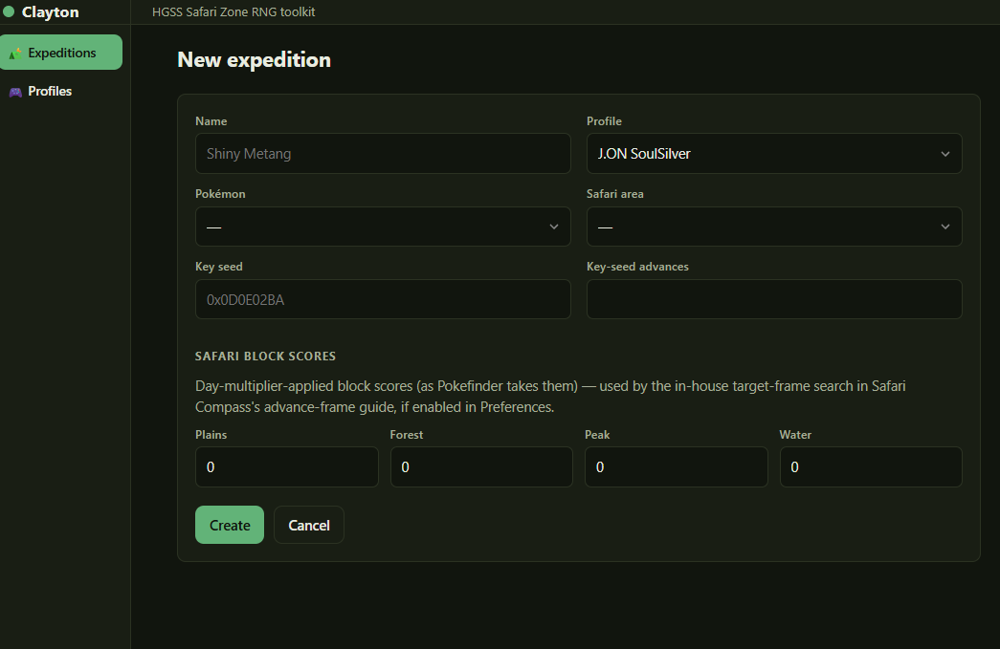
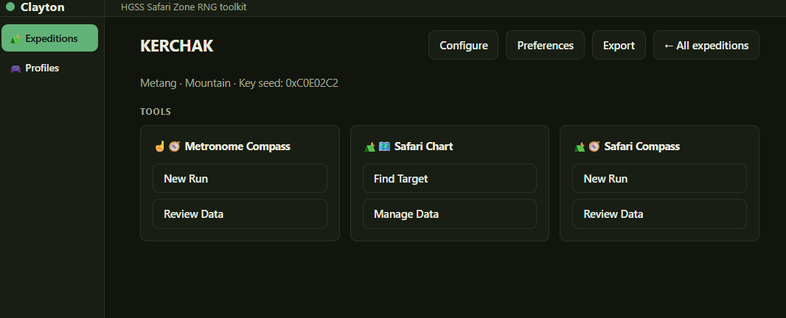

# 3. Getting started

Clayton installed ([page 2](02-installation.md))? This is the setup you do once before
any hunting: a profile for your game, and an expedition for the Pokémon you're after.

## Step 1 — Make a profile

A **profile** is one game on one console. It owns your saved runs and your calibration
models, because both are properties of that physical setup — a different console, or the same
game on a different flashcart, times differently and needs its own profile.

**Profiles → New.**

| Field        | What to put                                               |
| ------------ | --------------------------------------------------------- |
| Name         | Anything you'll recognise: `SoulSilver — DSi`             |
| Trainer name | Your in-game name (a label; nothing is computed from it)  |
| Version      | HeartGold or SoulSilver                                   |
| Console      | Which DS. Worth recording — timing differs between models |

Once created, you'll have an option to add metronome users to the profile. Don't worry about that for now, we'll cover that in the metronome compass section.

## Step 2 — Make an expedition

An **expedition** is one hunt for one Pokémon. It holds the target seed, the area, and your
block scores. Charts and saved targets belong to it.

**Expeditions → New.**

| Field                 | What to put                                                            |
| --------------------- | ---------------------------------------------------------------------- |
| Name                  | Whatever you want. Must be unique across *all* profiles                   |
| Profile               | The profile above                                                      |
| Pokémon               | The species you're after                                               |
| Safari area           | Which area it's in — narrowed to areas that actually hold your species |
| **Key seed**          | The initial seed (Seed A) you intend to hit: `0x0D0E02BA`      |
| **Key-seed advances** | The Seed A advance frame you'll Sweet Scent on                         |
| Safari block scores   | See [page 8](08-safari-blocks.md)                                      |

### Where the key seed/key-seed advances come from

From whatever tool you prefer, like PokeFinder or RNGReporter. When you find a combination of seed and advances that produces the pokemon you want, that is your key seed and the key-seed advances. For example, on my file, seed 0x0C0E02C2 and 81 advances produces a shiny adamant Metang.

## Step 3 — Check the tools are there

Open the expedition. You should see three tools:

- **☝️🧭 Metronome Compass** — New Run, Review Data
- **⛺🗺️ Safari Chart** — Find Target, Manage Data
- **⛺🧭 Safari Compass** — New Run, Review Data

## What next

For the perfect, ideal run, you should now get ready to use metronome compass. However, it is not STRICTLY necessary, and it'll take time both to get set up and also to collect data.

If you do not use metronome compass, you can use the standard statistical model that ships with this software instead, and jump straight to using Safari Chart. It might not be as accurate or precise for your specific model, but it might be accurate enough to identify seeds in Safari Compass, and you can do some reasonable calibrations using only Safari Compass.

Set up your timer first ([page 4](04-timers.md)), then calibrate
([page 5](05-metronome-compass.md)).

---

Next: [Timers and hitting seeds](04-timers.md)
