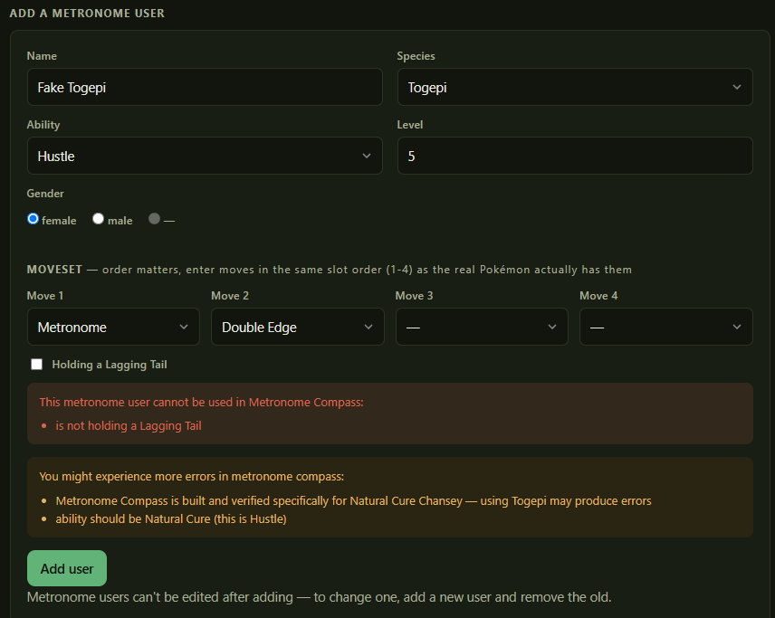
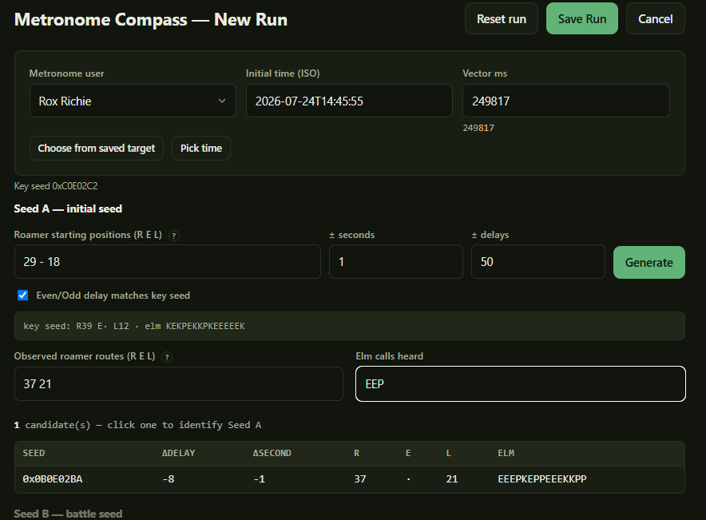
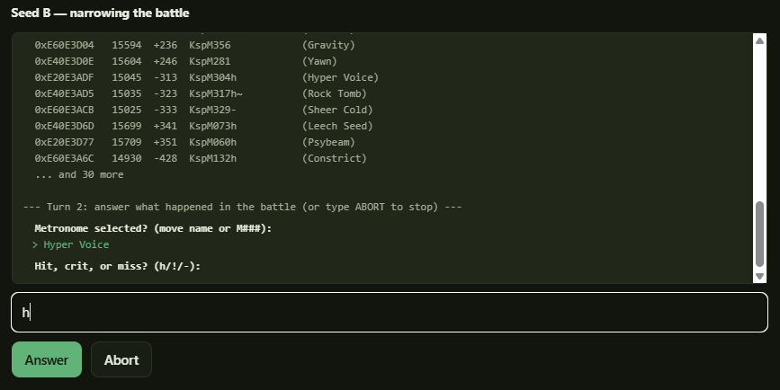
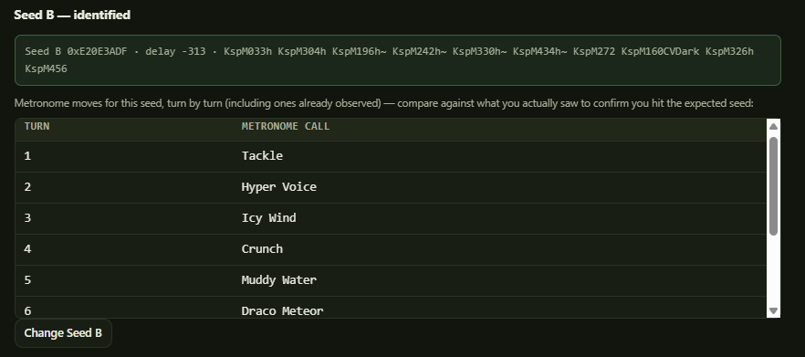
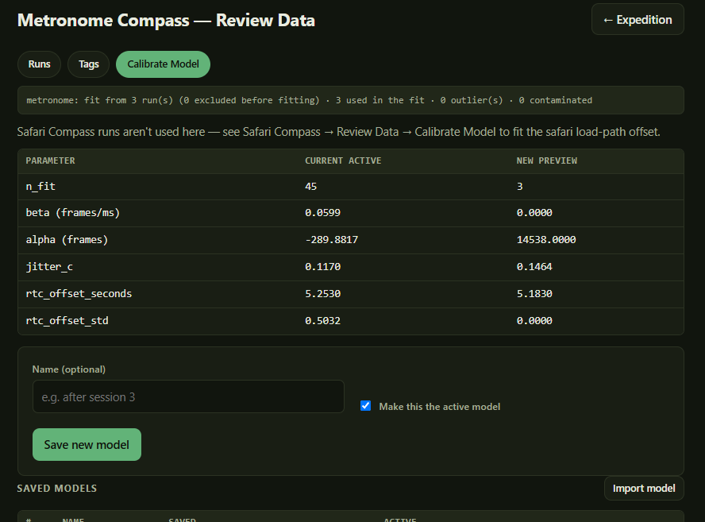

# 5. Metronome Compass

Metronome Compass is the tool for calibrating the general parameters of the statistical model to you and your hardware. Frame rate, delays, how precise our timing is, etc. It boils down to wanting to answer this question: **For a given amount of time (Vector ms), how many frames actually elapse between the game loading its initial RNG seed and the battle RNG state?**

The relationship is close to linear — roughly 59.83 frames per second — but the intercept and
the scatter are yours. They depend on your console, your cartridge or flashcart, and how
consistently you press.

To answer this question, we need to do runs where we know both Seed A and Seed B, as well as the amount of time we set for Timer 3/Vector ms. We collect these data points, and we use them to generate "models" that try to answer this core question.

## How Metronome Compass works

Identifying Seed B relies on identifying random events and using those random events to eliminate seeds where that outcome would not have happened, around an area we expect to find the seed. For Metronome compass, we have a pokemon use the move metronome, which has around 400 different possible outcomes, not even including things like secondary effects, misses, enemy pokemon moves, etc. Each move has roughly the same probability as well, which means consistently reducing the number of possible seeds. In my experience, checking an area of +/- 2000 frames and +/- 2 seconds (about 20,000 seeds) usually only takes 2 turns of battle to uniquely identify a seed.

This is why we have metronome compass and not just safari compass: In the Safari zone, throwing a ball has at most 5 different outcomes (0 shakes, 1 shake, 2/3 shakes, and a full capture), and other actions have less. All actions have an outcome that is more likely than the others. Because of this, it takes a lot more random events in the safari zone around a much smaller area to identify Seed B. On top of that, there are lots of values for Seed B where the pokemon will flee before you can uniquely identify it at all. I think I average around 25% of runs where I successfully identify the seed for metang, and for some pokemon it would be much worse.

Once you have identified Seed A and Seed B, with a configured vector ms, we can save this as a run, and that data point informs models.

### Models

A model is basically just a collection of numbers that we use to try and make accurate calculations. It is calibrated from the data we gather here, and used in both the Safari tools to try and find optimal values of Vector ms, as well as determine what seeds we are likely to hit in Safari Compass.

### Why Metronome Compass is optional

Given that, why would I say Metronome compass is optional?

First of all, it takes time. You need to get the resources in game for it to work, and then you have to spend time you could be spending trying to hit your seed on calibrating a model.

I have included a "Standard model" in the tool. As of the time I'm writing this, this is just the model I used myself, though I'm hoping people share data with me to make it a little more general purpose. It isn't perfect, but obviously it was good enough for me to identify seeds and eventually capture a shiny metang.

Additionally, metronome compass is not quite perfect. It isn't quite as flexible as it should be. It also depends on me understanding how **every single move and field condition** interact with the RNG and with each other. I did my best to be thorough, but I made mistakes, and the code is not perfect. If you suspect some moves are not implemented correctly, let me know, and we can try to correct it.

Finally, the accuracy of the model might not be as important for some pokemon as others. When I caught my Shiny metang, it was actually *500* frames earlier than the model predicted it would be, outside the expected range. However, it stuck around long enough for me to identify the seed in the larger area, and then Safari Machete was able to help me capture it (More about that in Safari Compass).

That aside, metronome compass was highly important to getting these tools working at all, and it is important for getting the best possible results from the other tools.

## What you'll need in game

In the game, you'll need these: 

* Access to Blackthorn City
* A sweet-scent user
* A surf user
* Lagging Tail
* A metronome user
* Highly recommended: Active Roamers
* Recommended: Pokerus

Hopefully, you've reached the point in the game where you have access to Blackthorn City, and much further: You have to have the national pokedex before you can fully unlock the Safari Zone, which is one of the first requirements for meeting most of the best safari zone pokemon, including Metang. However, all you technically need for this step is access to Blackthorn City.

The only thing you'll really NEED that is not a pokemon is the Lagging Tail. You can find this on Route 47, conveniently a route on the way to the Safari Zone. If you lost it somehow or if you prefer, wild slowpoke have a 5% chance to hold one as well, which you can find consistently in Slowpoke Well (<Cue surprised pikachu face>). Using RNG manipulation, if you identify your starting seed in there it should be near trivial to manipulate to find a slowpoke that is holding one, and honestly not too hard to just find it by using thief on them until you find it. This item is very important to ensure your metronome user always moves second.

Other than our main hero pokemon, you'll also need pokemon that know sweet scent to start the encounter and a pokemon that knows surf. The reasons will be pretty obvious soon. I recommend these NOT be your metronome user itself, but it doesn't really matter.

This is also much easier if you have active roamers in your game: The more the better. It'll make it much quicker to identify Seed A. 

I also recommend you get pokerus on one of your pokemon, not necessarily one of the ones you'll use here. Doing this allows you to use Professor Elm for your Elm calls instead of Irwin. I love Irwin, and when the values are E or K he's actually pretty fast, but when it is P Irwin's call takes a looong time, and the key to gathering good data is consistency. Professor Elm's calls all take about the same time, and you can only actually use him for elm calls once one of your pokemon has contracted Pokerus. I followed [this guide](https://www.youtube.com/watch?v=uu7nzNycwSs) myself, good luck to you.

Finally, you need a metronome user.

### Your metronome user

There are a handful of different pokemon that can know metronome, either through level up or egg moves. These pokemon have different stats, movepools, and abilities.

The ideal metronome user is weak offensively, but strong defensively. Weak offenses keep you from fainting the wild pokemon and ending the encounter before identifying the seed. Strong defenses keep you from BEING fainted by the wild pokemon and ending the encounter early. Speed does not matter - We'll be using a lagging tail to ensure you are always moving second.

A bit of a spoiler here, but we'll be fighting Magikarp, between level 2 and 20. It is weak offensively (If less than level 15, it won't even be able to hit you), but also not the strongest defensively. I chose them because of their weak offenses, and because they have a spawn table that is not shared with any other pokemon. You'll ideally be able to survive at least two tackles from a level 20 magikarp, and ideally hit a level 2 magikarp twice before it faints.

Movepool is also important. Something you might not know - Metronome actually won't pick moves the user already knows, and plenty of moves will prematurely end your run before identifying your seed. Explosion, U-turn, Baton pass, Healing Wish, Fling, Roar... These moves switch you out, faint your pokemon, force the magikarp to flee, make you lose your item, etc. Each of these renders metronome compass unable to continue if they don't identify your seed immediately.

Abilities are important, but mostly because of limitations of metronome compass. I have only tested the compass with Natural Cure on my metronome user, so other abilities are not tested. Serene Grace doubles the chance of secondary effects happening, Hustle affects accuracy, and Magic Guard can actually mess up subtle interactions with RNG related to user's healthiness. Abilities like Quick Feet or Intimidate are less likely to mess with the battle's RNG state though. Natural Cure is the one we built around (Since it literally can't affect anything).

The metronome user I chose was a Level 6 Chansey with the ability Natural Cure, and the moves Metronome, Fling, Healing Wish, and Solar Beam. 
* Chansey has great defense and terrible offense, much more defense than Happiny but not much worse than Blissey, while its offense is notably worse than Blissey. 
* I can prevent Healing Wish (which faints me), Fling (which loses my lagging tail and ends the run) and solar beam (Strong, super-effective damage into Magikarp).
* The ability Natural Cure won't mess with RNG.
* I bred it to have good defense and HP, and low attack and special attack, using vitamins to boost defensive stats as well, though EV training is limited by its low level. At level 6 these don't matter tooo much, but every little bit helps

In my use, it very rarely fainted from moves other than its own, even after SEVERAL turns, and I think only once did it faint a low level magikarp in just two turns (Using Roar of Time). Acquiring this Chansey took lots of work: 
* Had to catch a chansey first (Not tooooo hard with RNG manipulation)
* Bred it with my perfect ditto and used RNG manipulation to give it good bulk stats.
* Trained up chansey to level 42, until it knew Fling and Healing Wish
* Caught a MALE Clefairy
* Trained the male clefairy to Level 46 until it knew Healing Wish and Metronome
* Used the "Fling" TM on the male Clefairy (Only 1 per game...). 
* Bred the male clefairy with the female chansey. Metronome is an egg move, Healing Wish and Fling are level up moves that it learns early because both parents know them. Use RNG manipulation to try and get good bulk and bad offense IVs.
* Buy TM22 from Goldenrod, use it to teach this chansey SolarBeam
* Use a bunch of vitamins
* Level it up to level 6 in Slowpoke Well

You can see why I consider this step optional. In retrospect... This was probably largely *overkill*. I built a chansey where it wasn't uncommon for me to use all 10 PP for metronome. Since it takes about 2 metronome moves to identify a move in a pool of 20,000 seeds, this chansey could often identify a seed in a pool of more than *trillions*. And while I prevented a few moves that end runs early (2 for sure, 1 only if the magikarp is low level), there are still plenty of other ones.

**I would still recommend a level 6 chansey with natural cure, and maybe use some vitamins if you wish.** This does mean capturing a chansey and another metronome user, then breeding metronome onto the chansey. However, go to whatever lengths you feel are appropriate. A level 1 cleffa will still survive most turn 1's (Most magikarp are < Level 15, and the ones that aren't have a 50% chance to select tackle, and a 5% chance to miss). A level 100 Adamant full-offense Granbull might still miss the first move, select a status move, or even use false swipe, allowing you to get two moves off and potentially identify the seed. I wouldn't recommend these, but they CAN be used if you don't mind wasting more runs.

I'd avoid the abilities Serene Grace, Hustle, and Magic Guard if you can, since metronome compass is untested with them, but technically speaking the code for them SHOULD work. Cute Charm is fully NOT supported right now.

## Using Clayton
### Set yourself up in game

Once you have the requirements in game, get into position!
* Fly to Blackthorn City
* Add your sweet scent, surf, and metronome user to your party.
* Give your metronome user the lagging tail, and move it to the first position in your party.
* Use surf into the lake near the Blackthorn City Gym
* If you can, move Professor Elm (Or Irwin if you don't have pokerus) to the top of your pokegear contacts so he's ready to call.
* Check your pokegear and make a note of which routes your roamers are on. It is easier if this is the last screen accessed before you save your game.
* Save the game!

Once this is done, I recommend opening the pokemon summary screen for your metronome user so you can see it for this next step.

### Setting up a Metronome user in Clayton

Click the "Profiles" navigation button on the left sidebar, then click "Manage" on the profile you created earlier. There is a table showing metronome users, and a form to add them. Most of the fields are pretty obvious what they need, and the software should warn you if the pokemon you put in is not supported, though make sure to get the details right. In particular, the order of the moves actually DOES matter if metronome calls the move "Conversion", which determines what type your metronome user will become, and gender will matter for moves like attract and captivate.

Once you have a valid metronome user configured, we can use the compass!

*Clayton flags a user it can't calibrate reliably with — here, the reasons are listed as you fill the form in.*

## Doing a calibration run

Open your expedition, then under the metronome Compass category choose "New Run"

### Set the target

| Field          | What to put                                 |
| -------------- | ------------------------------------------- |
| Metronome user | The one you just made                       |
| Initial time   | The datetime you're aiming to hit Seed A on |
| Vector ms      | The countdown you're going to time          |

For best calibration, **vary Vector ms between runs**. A model fitted on six runs all at 300,000 ms
knows one point on a line and has to guess the slope. Spread them — 180,000 / 240,000 /
300,000 / 360,000 and so on — and the fit gets much better fast. Don't worry about times that are lower than you expect it will take you to get set up in the Safari Zone, or longer than you care to wait. That said, it can be useful to have a few data points on the same Vector ms just for you to see how much your frame is varying between runs. For your first run, feel free to make it a bit longer (~300,000?) so you can follow the guide without feeling rushed, but there is also merit to getting earlier results first so inaccuracies in the model are less likely to affect you finding your seed.

If you have already used Safari Chart and saved some targets from it, you can use those for the initial time/Vector ms field as well.

Metronome Compass assumes that you are going to try and hit your key seed for Seed A. If you want to hit a different seed, you'll need to make a different expedition, but the calibration runs are saved to the profile so if you use the same profile the data is still useful.

### Before attempting to hit your seed

Before you attempt to hit your seed, prefill some of the data:
* Put in the roamer starting positions you noted before. This field is numbers separated by spaces, assuming the roamer locations in R/E/L order. You can leave off numbers if you don't have those roamers, or use "-" to skip those roamers. If you have Raikou and Latios, you can do it like "35 - 14". If you have Raikou and Entei, you can do "39 38". If you don't have any roamers, you can leave the field blank
* Put in the expected +/- second and delay. This should be familiar if you've used other RNG manipulation tools before. You also have a checkbox to filter out seeds on delays that do not match the target.
* Hit enter or the "Generate" button to generate a list of seeds around your target

### Identify Seed A

Run your timers! Once you load into the game, quickly open your menu and work to identify your seed before the third timer goes off. Clayton is built to help you identify your seed quickly.

First of all, open the pokegear and identify the routes of your roamers. Since you're in a city, if you have both roamers but you see Raikou and not Entei, he's on the same route as Raikou. Type these into the "Observed Roamer routes", separated by spaces. It will narrow down the seed in real time. You can use "." to skip indicating the route for that particular roamer, or just not type the number in. You don't need to put all the roamers in - If all the remaining seeds have the same value for L after putting in R and E, just skip to the elm calls input, which you can do by hitting "enter".

If you already only have 1 candidate seed remaining, just hit enter again and it will confirm that seed as your Seed A. If not, call Professor Elm and note his responses in the input field UNTIL there is only one result remaining. Blackthorn City has a decent number of roaming NPC's, so the match might be a little down the line. Once there is only one result, hit enter to lock in Seed A.

If you know what seed you hit, you can just click the row in the table to select that seed, even if other candidates remain in the table.

> It is fine if you don't hit your key seed exactly - It doesn't really matter for the purposes of our calibration. In fact, if you DO hit your key seed, maybe you want to abort the run and actually try to find a shiny pokemon?

Now, back out of the pokegear, go to your pokemon screen and get ready to hit "Sweet scent" once that third timer goes off.

### Identify Seed B

When Timer 3 goes off, hit A and trigger sweet-scent! Technically the seed won't generate until after the animation plays, but our model compensates for that. If you don't hit your timer with good timing, restart from the previous step - You don't want to put known sloppy timing into your calibrations.

Now before you can identify your seed, metronome compass needs to know what we're working with. Type in the details of the Magikarp, the level and gender, then hit enter and Clayton will generate the details of all our candidate seeds. By default it looks around 2000 frames from the center, and 2 seconds, but you can adjust these values if you wish to make the search more robust (larger) or faster (smaller).

> Protip: While the magikarp level field is selected, you can type "m" or "f" to set magikarp's gender without using the mouse, and then hit enter. Convenient!

Now the meat of Metronome Compass: The interview! This is a series of prompts that help determine our seed. For each step, you'll use the move "Metronome" in the game, and then take note of what happens in that turn of battle. The biggest piece is obviously what move metronome selected, but there's a lot of other things to track as well - Move misses, crits, etc. Status moves failing do not count as misses. If Magikarp is Lvl 15 or more, you need to note whether it tackles or splashes, and whether or not tackle hits or crits. Note if Magikarp is confused, paralyzed, or otherwise prevented from moving. Does outrage end on turn 2 or 3? Does double slap hit 5 times, with a crit on the fourth hit? What stat does acupressure raise?

This can be kinda a lot to track in some cases, so I recommend paying attention to what happens exactly, and not putting the inputs into metronome compass until the turn is over. For moves that last multiple turns or land multiple hits, this can be a little much, so being ready to take hasty notes into a word doc or piece of paper might be good too.

As I mentioned before, it usually only takes a couple moves to identify the seed. There are also moves that might unfortunately end the run before identifying the seed, such as if your metronome user explodes. You can still input these moves into the compass, it might be enough to narrow it down anyways, but if not you'll have to restart the run.

There is an important limitation of metronome compass - It is not a battle simulator. It doesn't know the magikarp's IV's, or your pokemon's HP, etc. Unless you use a move that faints yourself or we can't predict, it won't know when magikarp or your pokemon faint.

> You'll see little things like "KspM300h" in the UI. Internally, metronome compass uses little codewords like this to describe turns. This one says Magikarp (K) used splash (sp), then the metronome user selected move 300 (M300) and that it hit (h). There are lots of other codes.

If you identify the seed, metronome compass will tell you what metronome moves it expects for the rest of the battle (up to 10 turns). You can use this to help verify that you actually hit the seed we think you did, assuming no pokemon have fainted by using metronome again. Or just for the fun of feeling like a true psychic trainer.

We have a little bit of an ouroboros situation here: Metronome Compass is used to calibrate models, but it uses a model to determine what seed we expect to hit here. Your first few runs will likely be far from expected, but hopefully as time goes you'll hit closer to the expected target more consistently.

Once the answers narrow it to a single seed, Clayton shows which one you hit, how far that was
from the target, and the whole move sequence for it:

*The move list runs past the turns you answered for, so you can keep comparing against what you
actually saw and confirm the identification was right.*

### Save the run

Finally, save the run! It will prompt you for two fields: Tag, and note. Tag is basically a name that different runs can group under. Note is a free-form note, so you can put notes about things you think might make the data unusable or other things. 

Unless you feel like you didn't hit timer 3 very well (Like you hit on the wrong beep, or significantly after the last beep), you should probably save all runs. Even if you hit really off target, that might be the model's fault more than your own. You can always exclude runs for consideration in calibration, or delete them outright, and the code excludes some outliers automatically.

## How many runs?

Rough, AI-generated guidance:

| Runs    | What you get                                   |
| ------- | ---------------------------------------------- |
| under 6 | not really a fit — the model is guessing       |
| 6–15    | usable; expect targets to be approximate       |
| 15–30   | good; this is where most people should aim     |
| 30+     | diminishing returns unless you change hardware |

**Spread of Vector ms matters more than raw count.** Fifteen runs across a wide range beat
thirty runs all at the same countdown.

## Metronome Compass - Review Data (Building the model)

On the expedition landing page, you can click "Review data" under metronome compass to view your runs! On the default page you see a table of runs, and you have the ability to review the key points and exclude runs you think are problematic.

| Column      | What it tells you                                       |
| ----------- | ------------------------------------------------------- |
| **Vms**     | the countdown you commanded                             |
| **V delay** | the frame difference you actually got (Seed B − Seed A) |
| **Δ delay** | how far that sits from what the active model predicted  |

Δ delay is the one to watch. Near zero means the model describes that run well. 

Most importantly, there is also a "Calibrate model" tab. This takes all the runs you have gathered and generates a model based on the ones that aren't excluded. *It does not consider the standard model or any data used to generate it*, so for best results use this after having done a handful of metronome compass runs. The model will not delete older models, and you can always switch which model is active in your project.

You'll see a live preview of the new model against your current active model. While not necessarily important for you to know, these are generally what the numbers mean:

| Parameter            | What it means                                                          |
| -------------------- | ---------------------------------------------------------------------- |
| `beta`               | frames per millisecond — should land near 0.0598                       |
| `alpha`              | the intercept — your setup's fixed offset                              |
| `jitter_c`           | your scatter. Lower is better; it sets how wide every search has to be |
| `rtc_offset_seconds` | how far the battle second sits from the countdown                      |

Give the new model a name of some sort, then hit "Save". Make it active to use it for Metronome Compass as well as other tools!

---

Next: [Safari Chart](06-safari-chart.md)
