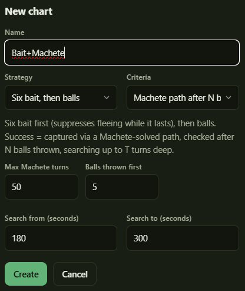
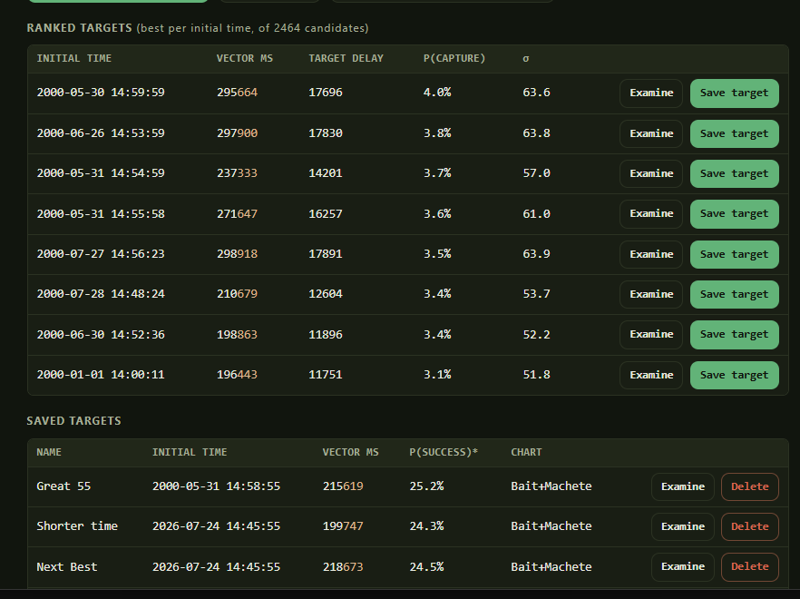

# 6. Safari Chart

Safari Chart answers one question: **which datetime should I boot on, and how long should
timer 3 be?**

It searches every datetime that produces your key seed, and for each one works out the best
countdown and how likely that attempt is to end in a capture.

## Charts

A **chart** is a strategy paired with a success condition "criteria", and related data. We build out a chart using a model to generate probable seeds during a run, and then use the strategy and criteria to mark these seeds as "successful" or not. You can have several per expedition and compare them.

### Strategies — what you'll do each turn

Strategies describe what course of action you'll take in the safari zone until the criteria is met. Do you want to just throw balls? Do you want to reduce flee chances by throwing 6 bait first?

| Strategy                 | What it assumes                                                |
| ------------------------ | -------------------------------------------------------------- |
| **Balls only**           | Throw a ball every turn. Simplest                              |
| **One mud, then balls**  | One mud first (raises catch rate), then balls                  |
| **Six bait, then balls** | Six bait first (suppresses fleeing while it lasts), then balls |

These are the only strategies currently supported - If you want a different one, let me know, it shouldn't be too hard to implement. 

### Criteria — what counts as success

Criteria is what determines if the given strategy counts as successful.

| Criteria                       | Success means                              |
| ------------------------------ | ------------------------------------------ |
| **Captured**                   | You caught it. The obvious goal.           |
| **Machete path after N balls** | A solved capture path exists after N balls |
| **Lasted N turns**             | Still on screen after N turns — not caught |
| **Lasted N balls**             | Caught, or N balls without fleeing         |

* **Captured** is the most straightforward - Just using the configured strategy, will this seed lead to a capture
* **Lasted N turns/balls** is a little less straightforward - Instead of defining success as a capture alone, it defines success as a pokemon not fleeing for N turns/after N balls were thrown. This is not as useful when you're actually trying to catch a pokemon, but when using Safari Compass runs to calibrate the model, this is useful for that, since a pokemon that sticks around longer means you are more likely to identify your seed.
* Finally **Machete path after N balls** is probably the most useful/expensive "Criteria". **Machete** is a Safari Compass tool that simulates every possible action you take for a number of turns, looking for a series of actions that leads to a capture. It is very powerful, leading to many captures that would not be possible otherwise, but also computationally expensive, and it requires you to know exactly what Seed B you are on in order to work. So in general, you want to wait until a certain number of balls/random events have occurred, giving you a chance to identify the seed. This "Criteria" waits until N balls have been thrown (according to the given strategy), and then runs machete to see if there is a path to success. You can configure how far ahead machete looks, but the longer you configure it to look, it takes exponentially more time to actually check each seed.

### The window

You want to configure a window of time to actually check. Sure there might be a great area of seeds after 10 minutes, but do you really want that over one that is 3 minutes away? The farther away, the more likely for the model to drift as well. You could be really fast with a minimum time of 150 seconds, but you'd better be really quick at getting into position.

Additionally, while most of the charts are pretty quick to calculate, if you use the Machete path criteria, it can actually take quite a while. 

Unlike Strategy/Criteria, you can adjust the window without having to recalculate the whole thing or create a new chart. You can start with a smaller window (200-220) to find a decent early target, then expand the window to find more juicy targets outside it while you continue working.

`setup_delay_seconds` to `max_target_seconds` bounds the countdown. The lower bound must be
long enough to actually do your setup — 180 s is a sensible floor.

## Computing the chart

When the chart is created and the window is set, you can hit "Compute chart" to begin the process of finding candidate seeds and calculating whether they succeed or not. For most strategies and criteria, this is relatively fast, even over a window of several minutes, but for charts with the machete criteria configured, this can actually take hours to calculate.

While you can't change strategy/criteria without needing a whole new chart, you CAN adjust the window. If you are creating a chart with the machete algorithm, I suggest starting with a narrow window (190-200, for example), and then once you have a target to test against you can increase this window drastically and run compute chart in the background while you use that initial target in Safari Compass. You are free to navigate between other tools while the chart is computing as well.

Compute chart is intelligently extendable - It won't recompute the seeds you've already calculated when you hit recompute. This is good not just for expanding the window, but for when the model is adjusted. A changed model changes which candidate seeds are considered likely, and often means generating more data for storing in the chart. The chart expands coverage for whatever the active model is, but does not need to recalculate the seeds it has already done. If the chart gets too big, you can always clear this saved data in the "Manage Data" tool. Shrinking the configured window for the chart does not delete data from here, but does affect the ranking of targets, which is nice if you want to find targets in a specific timeframe.

You can also try creating a chart with a low machete value and then one with a higher machete value, but that is not a pattern that is extensible and will maintain two separate charts.

> Charts with the same Pokémon, key seed, strategy and criteria **share** one dataset — the
> `reuse` figure in Manage Data shows how much that saved. This means two expeditions can share
> expensive-to-compute data without wasting disk space.

## Ranking and Choosing Targets

**Rank targets** scores every candidate boot time and time within the currently configured chart window.

This takes some small amount of time, and ranks combinations of "initial times" (Seed A times) and vector ms on their likelihood of success given the chart and model. The report first generated shows top results over all the initial times, but you can also use "Find best target at specific time" if you want to find the best time for a specific date/time combination.

In any case, you'll get tables with rows of different possible targets, which are combinations of initial times and vector ms. It gives a breakdown of how likely "success" is predicted to be at that location, and gives you the ability to examine the target to see the seeds that contribute to that number, broken up by RTC second and the calculated likelihood of hitting that seed.

The most important button is "Save target." It saves this target to a collection on the expedition, and you can easily re-use it in the Compass tools.

## Manage Data

Charts, their computed data and its size on disk, and your saved targets are all saved data that can be managed with the "Manage data" tool.

- **Delete computed data** deletes the computed data; the chart stays and can rebuild.
- **Delete chart** also removes its computed data (unless another chart in Clayton shares it), and then deletes the chart itself from the expedition.

---

Next: [Safari Compass](07-safari-compass.md)
