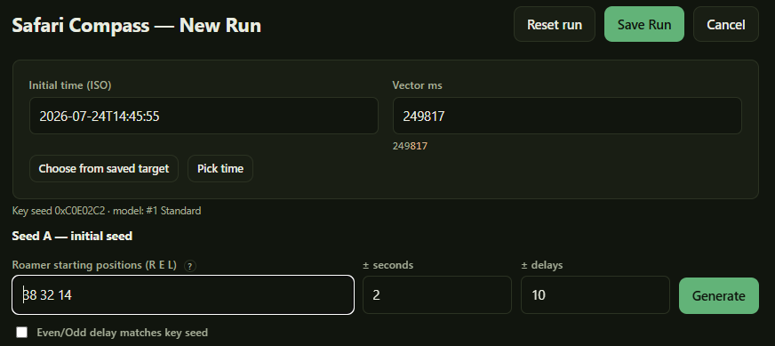
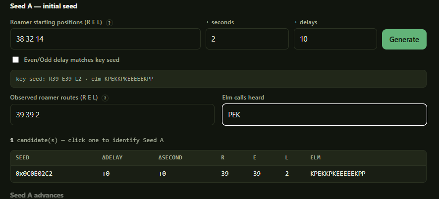
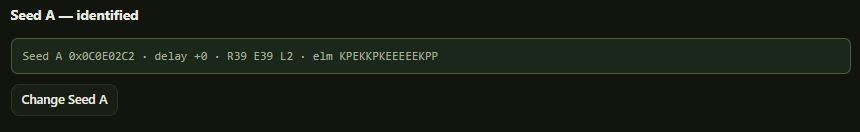
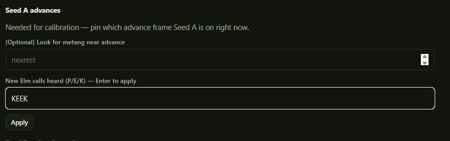
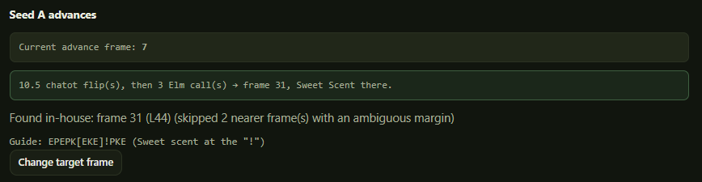
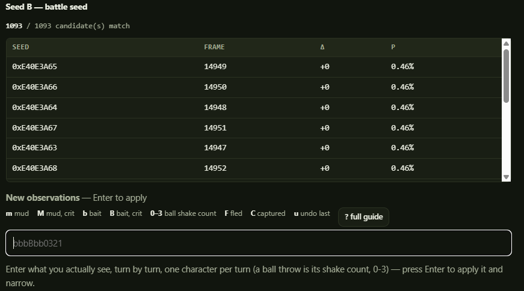
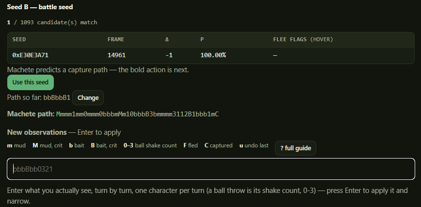

# 7. Safari Compass

This is the reason the other tools exist - This is the tool that helps you actually perform the capture of the pokemon you want. It tells you which seed A you actually hit, walks
you to the right advance frame, and once the battle starts, helps you identify what Seed B you hit and maybe even tells you how to catch it.

## What you'll need in game

* Set up Safari Blocks
* 2 chatots
* A custom "Chatter" message
* Sweet-scent user
* Surf user if you are hunting a pokemon caught in the water
* Optional: Synchronize lead, cute charm lead, etc. if required to find your shiny
* Optional: Position your safari area of choice in front of the entrance.
* Optional: A repel

First of all, if you don't have the safari zone blocks set up correctly, you won't be able to encounter your pokemon at all, no matter what seeds you hit. Unfortunately, this might require you to wait for days, even months, for the block multipliers to become strong enough to capture your desired pokemon, though depending on available hardware you miiight be able to trick the game into thinking more time has passed than it has. I have a small guide here on the block multipliers

You also need 2 chatots. These will help in rapidly advancing frames to your desired target. Technically, you couuuld do this without them, but there really isn't any reason to: They're easy enough to catch once you've gotten far enough along in the game. You'll need to record a custom "Chatter" message for them for the RNG to work.

You obviously need a sweet scent user to trigger the encounter, and if you are hunting a pokemon on water you'll need a pokemon that knows surf. If your encounter requires a specific lead pokemon (Cute charm stuff, synchronize stuff), you can have that, and even though they won't come to the battle they'll still apply the usual effects.

It is recommended to position your target area in front of the entrance to reduce RNG advances that can be caused by walking several steps. Since you can't save in the safari zone, you'll need to walk to the location. That's also what the repel is for - It can mess up your run if you trigger an encounter right when you walk into the grass.

### SIDE NOTE: Fishing

For the sake of simplicity, this guide is going to assume you are catching a pokemon in grass or surf. I have not tried this with fishing pokemon, but the animation is quite different from sweet scent, so I assume the timings will be quite different.

My recommendation would be that you do not use safari runs using sweet scent and safari runs using the fishing pole together on the same calibration. You can either manually exclude all safari fishing runs while calibrating normally, and only fishing runs while calibrating model for fishing (easy enough using tag exclusions), or you can create an entirely different profile for use with fishing. I'll explain model calibrations later.

## Safari Compass Run
### Setting yourself up in game
* Grab what pokemon you need out of the box. If you need a lead pokemon set them as the lead. Make sure you have your two chatot and that they are next to each other in your party.
* Fly to the safari zone area. If you are there already, go south until you hit Route 48 and come back to make sure the roamers shuffle.
* Go stand in front of the man who takes you into the safari zone.
* Open pokegear and make note of the position of the roamers, and mark it down.
* Use your repel if you are catching pokemon in grass.
* Save, close the game, and get ready to go.

### Get Clayton ready

Choose a target. You can choose from your saved targets, or manually enter the initial time and Vector ms.

Put the roamer starting positions from the previous step into their fields, adjust the delay/second config to your liking, and hit generate. It'll show you where the roamers need to be to indicate you might've hit your key seed.

If your timers aren't set up yet to hit that initial seed and Vector ms, do it now.

Once all of that is ready, you can begin!



## Step 1 — Seed A

Attempt to hit your key seed, just like you would with any other RNG attempt, only using the custom timer that has the 3rd phase. 

Once you've loaded into the game, you can open your pokegear really quick to check your roamers. If you are making a genuine attempt to catch your shiny pokemon and the roamers don't match what you expect, you can reset here and keep trying until they do, but I don't recommend doing the elm calls just yet. If you are doing a run to help calibrate the model (which is important to do), I recommend not bothering to check the roamers until you are in the grass.

Talk to the man at the counter, and get through his text as quick as possible, then run into the safari zone and walk into the grass. NOW open your pokegear and confirm your roamers if you haven't already. Then do elm calls until the seed is identified. Again, if you are done calibrating and just want to find your pokemon, and you didn't hit your seed here, you can reset. Otherwise hit enter/click on the identified seed to lock it in and move to the next step.



*The key-seed line above the inputs is what you are trying to match — routes, then Elm calls. One candidate left means Seed A is pinned.*




## Step 2 — Seed A advances

The next step is to hit an advance that contains your target pokemon.

### Pinning where you are

Type the Elm calls you've heard so far. By default this should already contain the calls you did to identify the seed. As you do this the program will narrow down what frame you are on. You can put multiple calls in the input line, but it doesn't narrow down until you hit enter.

If you didn't hit your key seed, there is also an optional field that says "look for <pokemon> near advance." This input is taken for the next step.



Once you have given enough calls for Clayton to identify your exact frame (Might not need to be any more than you already have for the Seed A identification), it moves on to planning your route to your pokemon.

### The route - Choosing target frame

Clayton then plans a route to your target frame. If you hit your key seed, it **always** plans to hit your key seed advances configured in the expedition. Otherwise, by default it looks for the nearest frame that would lead to a pokemon of the species you are targeting (Though it does some suitability filtering to make sure you can confirm your target, explained below).

If you put a target in the optional field from the previous step, instead of just looking for the frame nearest you, it looks for the frame nearest the value you gave it. For example, if you gave it a value of 100, and you were on frame 15, it would plan to take you to the metang on frame 98 instead of one on frame 19.

This in-house pokemon finder is optional. If you prefer to find it yourself, you can change that in preferences and use pokefinder or a tool like it to find a pokemon to hit. This gives you a little more leeway into finding pokemon holding items or with better stats, in case you catch it.

### The route - Determining the route

Once Clayton knows where you are and what advance frame it wants you to hit, it generates the route. The route usually looks something like this:

```
33.5 chatot flip(s), then 3 Elm call(s) → frame 81, Sweet Scent there.
```

It also produces a guide that looks something like this:

```
PEEEP[KPE]!KEP
```



*Both together, as Clayton shows them — the current frame, the route to the target, and the
guide string with `!` marking where to Sweet Scent.*

Let me explain: **Chatot flips** are used for advancing the game fast. To make it easier to count, a flip is actually 2 chatot screens. You look at the first chatot screen, then flip to the other, and that is 1 chatot flip. Then you go back to the other screen, and flip again, that's 2. It is a lot easier to quickly count to 33 instead of counting to 66 every time you alternate. Of course that means when the number of advances to do is odd, you'll end up with the .5 after the count, for which you just switch to the other chatot and then exit the summary screen.

This makes it easier to not mess up your count, but it is still not difficult to mess up. That's why we try to reserve a few elm calls at the end so you can be confident you counted correctly. It is usually 3, but if you are very close to your frame it might be less or more (If chatot flips would be 1 or less, we just let you do more elm calls). There is a setting in preferences if you prefer more or less elm calls at the end.

That is what the guide tells you: It shows the elm calls immediately preceding your target, then the elm calls it expects you to hear in the brackets, and then an exclamation point to indicate you should use sweet scent before advancing further, and then also some calls after the sweet scent so you can know if you missed.

For the example guide above, if you did chatot flips but thought you might be off by 1, then you call elm and you get his P response then his E response, you can reasonably determine that you probably did half a chatot flip too many and hit sweet scent here instead of doing that last elm call. Likewise, if you get PKP, you can guess that you actually did one chatot flip too few, and do that last extra elm call.

Now that you've done this, back out of the pokegear, go to the pokemon summary screen and get ready to press sweet scent. This was a lot to do relatively quickly, and now you just have to wait for Timer 3 to go off!

### When the margin is ambiguous

When picking a target frame, Clayton filters routes whose final Elm calls read the same a frame or two on either side — where a miscount would be invisible. For example, if the closest target frame would lead to a guide like this:
> PEPKE[EEE]!EKP

How would the 3 elm calls let you know you hit your seed? If you get 3 E responses you could be one frame early OR late in this particular case.

Just thought you ought to know in case the frame it finds is further away than you would expect.

## Seed B - THE ENCOUNTER

Once timer 3 goes off, fire off sweet scent! If you hit your key seed, your target pokemon should be staring at you now. If you didn't hit your key seed, another pokemon of the same species should be right there. If not, either your advances messed up, your blocks are messed up, or Clayton's code is messed up (oops!).

Now we try to identify what seed B you hit. There is an input line that records what action you took and its outcome in a concise format - Each character basically corresponds to one outcome, one message.

This part doesn't /yet/ recommend what you should do. You should likely use whatever strategy you used for the chart. For catching Metang, I prefer throwing six bait and then throwing balls.

Now type what you see, one letter/number per turn (Except for the pokemon fleeing):

| Type | Action                  | What you saw                        |
| ---- | ----------------------- | ----------------------------------- |
| `m`  | Mud, no crit            | *"X is angry!"*                     |
| `M`  | Mud, crit               | *"X is beside itself with anger!"*  |
| `b`  | Bait, no crit           | *"X is eating!"*                    |
| `B`  | Bait, crit              | *"X is busy eating!"*               |
| `0`  | Ball, 0 shakes          | *"Oh, no! The Pokémon broke free!"* |
| `1`  | Ball, 1 shake           | *"Aww! It appeared to be caught!"*  |
| `2`  | Ball, 2 shakes          | *"Aargh! Almost had it!"*           |
| `3`  | Ball, 3 shakes          | *"Shoot! It was so close, too!"*    |
| `C`  | Captured — ends the run | *"Gotcha!"*                         |
| `F`  | Fled — ends the run     | *"X fled!"*                         |
| `u`  | Undo the last turn      |                                     |

You can see this table in the Clayton app itself by opening the full guide, and there is a mini guide on it as well.



*The candidate count at the top is what you are driving down. Every character you add filters
the list; the legend under the input is the same table, abbreviated.*

The pokemon might flee before you catch it. That's fine, and should be expected - If these pokemon were easy to catch, this tool wouldn't be here. Sometimes during calibration runs that's more than okay - It is just as good as a capture if you successfully narrowed it down to 1 seed.


You can type as many letters as you want before hitting enter. Once you do, it will filter seeds that do not match from the results. Keep in mind the initial results are determined by the model, but your seed B might very well be outside it. If all the seeds are filtered out, do not despair, just widen the search until it finds a possible seed.

### Wait I missed that...

If you chose an action but forgot to watch for the outcome (You threw bait, but didn't remark if Metang was "eating" or "busy eating"), you can use a "?" character to precede your action to indicate you aren't sure the outcome was what you typed. In this example, you could type "?b" or "?B", both function the same. ?0 indicates a ball thrown with an uncertain outcome (though obviously not capture), ?m indicates mud thrown, etc. It won't narrow out many candidates (except ones where metang fled before you could throw), but it keeps the RNG state tracking on the right course as you make more observations.

### Machete

Once you have narrowed it down to only 1 possible seed, Clayton automatically starts using "Machete" to try and find a successful capture path. I mentioned it in the guide for Safari Chart, but this tool brute-forces every possible action you can take up to X turns and tries to find a way to capture this pokemon.

The default is 50 turns. You can change this in preferences, but increasing it increases the time machete takes to run, while decreasing it obviously decreases its effective range.

If machete finds a path, it will output that path for you, with the next action/outcome you should take highlighted. Congratulations, this *should* lead to a capture. If machete does not find a path, it will tell you. It could be that your metang is doomed to flee in 3 turns no matter what you do. It could be that 50 turns just isn't far enough to find the successful capture. Keep throwing balls or bait or mud and see what happens. One of my first captured non-shiny metangs, I didn't identify the seed until I was down to 20 safari balls, and machete didn't find the path until I was down to 5. Then I threw a crazy-long sequence of mud and bait, and caught the metang with my very last safari ball.

Keep in mind this will not work if you didn't actually find your candidate seed. A false identification could lead to your pokemon fleeing while you follow the machete path, so use with caution and continue inputting the results you are seeing so that if you see an outcome different from the machete path you can expand your search. I have had it happen at least once that machete recommended a path to me that involved throwing mud right away, and then metang fled and I found out I found the wrong seed.



### Flee flags

Once you're down to a handful of candidates, each row is checked three turns ahead to see if the candidate will flee. The flags are a little terse in meaning, but hovering over them gives a better explanation.

| Flag     | Meaning                                                      |
| -------- | ------------------------------------------------------------ |
| `F0`     | flees **this turn** if you throw a ball                      |
| `Fb2`    | flees within 2 turns if you bait                             |
| `F3`     | flees within 3 turns **whatever** you do                     |
| **`F!`** | this candidate has **already fled** — type `F` to confirm it |

`F!` is shown in a different colour because it is not a prediction of your next turn. It means the last thing you did already ended the run for that candidate, and Clayton is waiting for you to confirm. If the pokemon did not flee, that means that is not a valid candidate and is eliminated on your next input.

These flee flags can be helpful to avoid terminating early. If you are on your key seed, sticking around longer gives machete more opportunities to find a path. If you are not, it can help you identify your seed better for calibration.

### Save run

If your run ended in a successful seed identification, if not a successful capture, then you can save the run. This is useful for calibrating the model. This is very similar to the metronome compass run save - It has a tag for grouping similar runs together, and a free-form notes field. Additionally, it collects some metadata about advances, chatot flips, and elm calls. This is prepopulated from what seed A recommended, but if actual results are different you can change this.

## Feeding calibration

Metronome Compass generates most of the fields for the model, but the circumstances of metronome compass and safari compass are different. You don't have to load into the safari zone, or do a bunch of chatot flips. So we have a way to calibrate models using Safari Compass data as well.


**Safari Compass → Review Data → Calibrate Model** fits the **safari offset** — how far the
Safari Zone's extra loading screen pushes the frame compared to the metronome path.

It works from a base model you choose (your metronome fit) and only adjusts the safari
offset, leaving the trend alone. A safari run cannot determine the trend by itself.

Two optional checkboxes:

- **Fit a per-advance offset** — tests whether the number of advances shifts the landing
  frame. Off by default. When on, the fitted slope comes with an uncertainty in frames at
  *your* advance count; treat a wide interval as "keep collecting", not as a result.
- **Use the safari runs' own spread** — measures scatter on the safari path rather than
  inheriting the metronome path's.

These are included in the software, but their usefulness has not yet been determined.

---

Next: [Safari blocks](08-safari-blocks.md)
